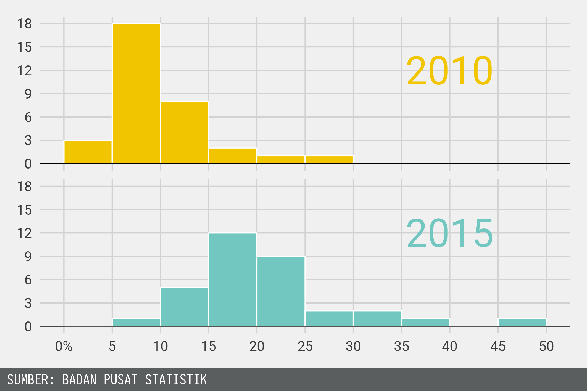

## Overview

1. Motivasi

2. Metodologi

3. Hasil dan Kesimpulan

4. Promosi

## Motivasi

### Why Internet?

+ Internet is usefull for individuals and firms.
    - reduce cost $\rightarrow$ moar profit.
    - work faster $\rightarrow$ moar productivity.
    - share knowledge
+ More people utilizing internet $\rightarrow$ increase economic growth.

+ Internet user = Internet Penetration Rate a.k.a Tingkat Penetrasi Internet.

## Motivasi

### Why Provincial Data?

Jumlah amatan yang lebih banyak jika menggunakan data panel.

### Why 2010 - 2015?

All the data I can get.

# Metodologi

## Cobb-Douglass

Output adalah fungsi dari kapital dan tenaga kerja.
Kapital dibagi menjadi dua, yaitu investasi dan *human capital*.

$${Y}_{it} = A \times K^{\beta_1}_{it} \times H^{\beta_2}_{it} \times L^{\beta_3}_{it}$$

Faktor pengguna internet dimasukkan dengan menggunakan TFP
$$A = A_0 \times I^{\beta_4}_{it}$$

## Cobb-Douglass

Lakukan subsitusi untuk memasukkan faktor internet.

$${Y}_{it} = A_0 \times K^{\beta_1}_{it} \times H^{\beta_2}_{it} \times L^{\beta_3}_{it} \times I^{\beta_4}$$

Dilakukan transformasi logaritma natural.

$$\ln(Y_{it}) = \ln(A_0) + \beta_1 \ln(K_{it}) + \beta_2 \ln(H_{it}) + \beta_3 \ln(L_{it}) + \beta_4 \ln(I_{it})$$

Penulisan yang lebih sederhana.

$$\acute{Y}_{it} = \acute{A_0} + \beta_1 \acute{K}_{it} + \beta_2 \acute{H}_{it} + \beta_3 \acute{L}_{it} + \beta_4 \acute{I}_{it}$$

## Cobb-Douglass

$$\acute{Y}_{it} = \acute{A_0} + \beta_1 \acute{K}_{it} + \beta_2 \acute{H}_{it} + \beta_3 \acute{L}_{it} + \beta_4 \acute{I}_{it}$$

+ $i$ adalah Provinsi, $t$ adalah Tahun,
+ $Y$ adalah Output,
+ $A_0$ adalah TFP,
+ $K$ adalah investasi,
+ $H$ adalah faktor *human capital* atau SDM.
+ $L$ adalah faktor tenaga kerja, dan
+ $I$ adalah faktor penetrasi internet.

$\beta_1$, $\beta_2$, $\beta_3$, dan $\beta_4$ adalah elastisitas dari masing-masing faktor produksi.

##

### Hipotesis penelitian

Tingkat penetrasi internet berpengaruh positif bagi pertumbuhan ekonomi.

$${\beta_4} > 0$$

## Data

- *Balanced Panel* : 33 provinsi selama 2010 sampai 2015.
- Semua provinsi kecuali kalimantan utara.
- Sumber : Situs BPS dan Statistik Telekomunikasi Indonesia 2011 dan 2015.

## Data
+ Produk Domestik Regional Bruto Atas Dasar Harga Konstan 2010 $\rightarrow$ $Y$
+ Pembentukkan Modal Tetap Bruto $\rightarrow$ $K$
+ Angka Partisipasi Kasar Sekolah Menengah $\rightarrow$ $H$
+ Tingkat Kesempatan Kerja $\rightarrow$ $L$
+ Persentase penduduk umur 5 tahun ke atas yang pernah mengakses internet dalam 3 bulan terakhir $\rightarrow$ $I$

## Data

```{r input-data, include = F}
library(tidyverse)
net <- read_csv("data/net_clean.csv")
```

```{r print-data, echo=F}
print(net)
```

## Model Panel

1. Model *Pooled OLS* (POLS)
2. Model *fixed effect* (FE)
3. Model *random effect* (RE)

## Model POLS

POLS : *just do OLS!*

$$
\acute{Y}_{it} =
{\delta} +
\beta_1 \acute{K}_{it} +
\beta_2 \acute{H}_{it} +
\beta_3 \acute{L}_{it} +
\beta_4 \acute{I}_{it} +
{\upsilon}_{it}
$$

+ ${\delta}$ adalah intersep.
+ ${\upsilon}_{it}$ adalah galat atau *error*.
+ Estimasi : [O]rdinary [L]east [S]quare

## Model FE

FE : *variation across time!*

$$
\ddot{Y}_{it} =
\beta_1 \ddot{K}_{it} +
\beta_2 \ddot{H}_{it} +
\beta_3 \ddot{L}_{it} +
\beta_4 \ddot{I}_{it} +
\ddot{\epsilon}_{it}
$$

+ $\ddot{Y}_{it} = (\acute{Y}_{it} - \bar{\acute{Y}}_{i\bullet})$
+ $\ddot{K}_{it} = (\acute{K}_{it} - \bar{\acute{K}}_{i\bullet})$
+ dst...
+ $\ddot{\epsilon}_{it} = ({\epsilon}_{it} - \bar{\epsilon}_{i\bullet})$ adalah galat
+ Estimasi : [O]rdinary [L]east [S]quare

## Overbar

Tanda *overbar* menunjukkan rata-rata waktu di dalam (*within*) provinsi tersebut.

$$\bar{\acute{Y}}_{i\bullet} = \sum_{t=1}^{T}{\acute{Y}_{it}}/T$$

## Model RE

RE : *FGLS is da wey!*

$$
\tilde{Y}_{it} =
(1 - \theta) {\delta} +
\beta_1 \tilde{K}_{it} +
\beta_2 \tilde{H}_{it} +
\beta_3 \tilde{L}_{it} +
\beta_4 \tilde{I}_{it} +
\tilde{\upsilon}_{it}
$$

+ $\tilde{Y}_{it} = (\acute{Y}_{it} - \theta \times \bar{\acute{Y}}_{i\bullet})$
+ $\tilde{K}_{it} = (\acute{K}_{it} - \theta \times \bar{\acute{K}}_{i\bullet})$
+ dst...
+ $\tilde{\upsilon}_{it} = ({\upsilon}_{it} - \theta \times \bar{{\upsilon}}_{i\bullet})$ adalah galat
+ $0 < \theta < 1$
+ Estimasi : [F]easbile [G]eneralized [L]east [S]quare

# Hasil dan Kesimpulan

## Ringkasan Statistik

```{r sum-stat, echo = F}
tbl_sum_stat <- net %>%
  select(-i,-t) %>%
  gather(Vars, Data) %>%
  group_by(Vars) %>%
  summarise(MIN = min(Data) %>% round(2),
            MAX = max(Data) %>% round(2))

print(tbl_sum_stat)
```

Jangkauan atau *range* : [MIN,MAX]

## Pertumbuhan TPI



## Model linier

$$
\hat{\ddot{Y}}_{it} =
\underset{(0.077)}{0.384} \ddot{K}_{it} +
\underset{(0.043)}{0.103} \ddot{H}_{it} +
\underset{(0.468)}{1.254} \ddot{L}_{it} +
\underset{(0.023)}{0.149} \ddot{I}_{it}
$$

$R^{2} = 0.9210$

+ Model terbaik adalah model FE.

+ Semua variabel signifikan berpengaruh positif.

+ Faktor penetrasi internet memiliki pengaruh positif terhadap pertumbuhan ekonomi.


## Kesimpulan

1. Penetrasi internet di indonesia selama tahun 2010 sampai 2015 mengalami peningkatan.

2. Penetrasi internet berpengaruh postif terhadap pertumbuhan ekonomi provinsi.
   Peningkatan TPI sebesar 10pp akan meningkatkan pertumbuhan ekonomi sebesar 1,49%.

# Promosi

##


## GitHub

### Unduh di sini!

Makalah : [https://bit.ly/2uxwLdY](https://bit.ly/2uxwLdY)

*Slides* : [https://bit.ly/2Llrobx](https://bit.ly/2Llrobx)

*Source Code* : [https://github.com/rexevan/148429](https://github.com/rexevan/148429)
